# Singular Factory Chatbot | User Manual

Welcome to the user manual for our Singular factory chatbot! This manual will guide you through the features and functionalities of our application.

## Table of contents
- [Singular Factory Chatbot | User Manual](#singular-factory-chatbot--user-manual)
  - [Table of contents](#table-of-contents)
  - [Introduction](#introduction)
  - [Getting Started](#getting-started)
    - [Installation](#installation)
    - [Accessing the App](#accessing-the-app)
  - [Manual](#manual)
    - [Home](#home)
    - [Conversational chat](#conversational-chat)
  - [Code explanation](#code-explanation)
  - [- Backend(Flask):](#--backendflask)
    - [Flask init](#flask-init)
    - [Routes](#routes)
    - [Chat](#chat)
    - [Audio recorder](#audio-recorder)
    - [Speech2Text](#speech2text)
    - [Text2Speech](#text2speech)
  - [- Frontend(ReactJS):](#--frontendreactjs)
    - [App.js](#appjs)
    - [Chat.js](#chatjs)
    - [Whisper.js](#whisperjs)
    - [Conversation.js](#conversationjs)
  - [Contact Us](#contact-us)

---

## Introduction

This app is a simple chatbot that integrates some of the leading LLM models that we have actually on the market such as GPT by OpenAI and Mistral. It combines the power of React for the frontend and Flask for the backend, providing a seamless and responsive user experience.

## Getting Started

### Installation

To use our app, follow these steps :

1. Clone the repository:
   ```bash
   git clone https://github.com/Pedro-Sarmiento/SF_ShatBot
   ```

2. Install dependencies:
   ```bash
   cd cliente
   npm install  # For React dependencies
   cd server
   pip install -r requirements.txt  # For Flask dependencies
   ```

3. You need to create your .env file in the server folder with these variables:
   ```bash
   FLASK_ENV='development'
   OPENAI_API_KEY=
   DG_API_KEY=
   CLOUDINARY_URL=
   CLOUDINARY_API_KEY=
   CLOUDINARY_API_SECRET=
   EL_API_KEY=
   MISTRAL_API_KEY=
   ```

1. Start the development server:
   ```bash
   npm start  # Starts React frontend
   flask run  # Starts Flask backend
   ```

### Accessing the App

Once the development server is running, you can access the app at:
- Frontend: http://localhost:3000
- Backend: http://localhost:5000

## Manual

### Home

In this home page are able to chat with an LLM model, you can text directly in the text box or you can use the mic button and what you say is going to be added to the text box. You have to configure the parameters on the left pannel.

- **How to Use:**

  1. Select the model you want to chat with.
  2. Choose the language you want to use.
  3. Chat freely.
  4. You can clean the chat with the button.

- **How is it done:**

  - The text chat is simply a request to the API of the LLM that you have selected.  
  - The audio of the mic button records your voice and sends the generated .wav file to the DeepGram API and it returns the transcripted text.

Here´s the main page:

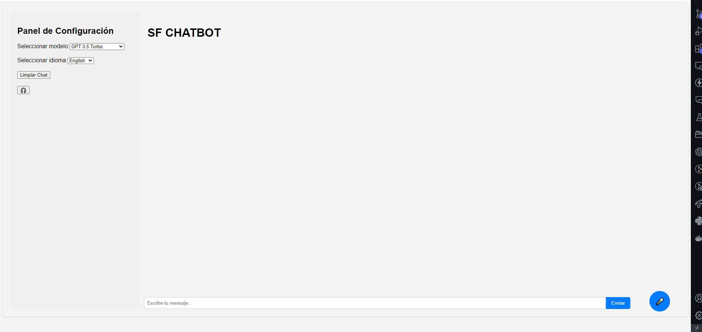

### Conversational chat

The conversational chat is a speech2speech conversation with the GPT 3.5 Turbo model, it has two modes:

  1. Normal mode: You click the mic button when you want to say something to the model.
  2. Half-duplex mode: Once the LLM model finishes talking, the program will start listening to you again, without the need to click the mic button.

- **How to Use:**

  1. Choose the language you want to conversate with the model.


  2. Start the conversation with the model, it is important to wait a second when you click the mic button, because if you don´t, it may not hear your firsts words.
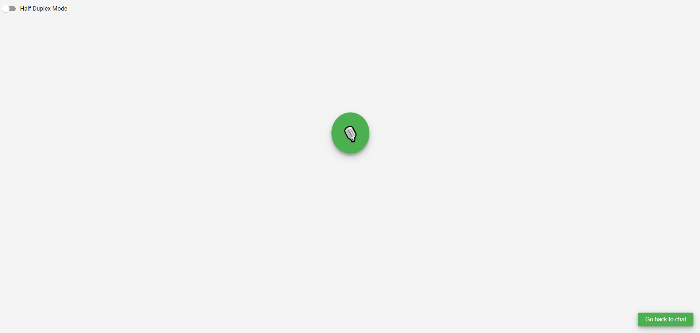

- **How is it done:**
  1. Your voice is recorded and sent to the DeepGram API, which returns the transcripted text.
  2. The transcripted text is passed to the GPT API.
  3. The response is sent to the DeepGram API if the selected language is English, if it is Spanish to the ElevenLabs API, and they return an audio file.
  4. The audio file is uploaded to Cloudinary, to improve the speed of the process.
  5. Finally, the audio is played from the Cloudinary URL.

## Code explanation

## - Backend(Flask):
### Flask init 

In this part we only config the cloudinary API and start the flask application depending on the configuration tha we have setted in the .env file.

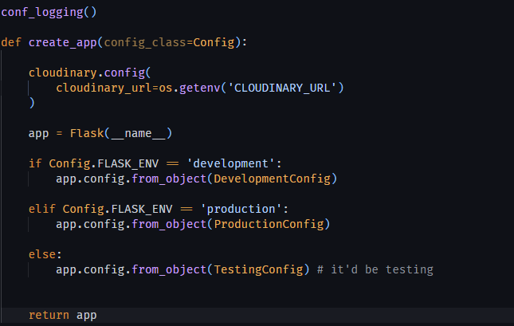

### Routes

Here we have our 4 API routes, the first two are made for the main page, the basic chat ("/") and the mic button ("/audio") to add text to the message box and the other two are for the conversational bot ("audio_recorder" and "audio_response"). This code provides an API for interacting with chatbots via text and audio inputs. It handles requests for text-based chatting, audio recording, and audio-based chatting.

1. Import Statements:
     - The code begins by importing necessary modules from Flask and other custom modules in the project.
     - It imports request, jsonify, and Blueprint from Flask.
     - It imports ChatGPT and Mistral from the src.chat module.
     - It imports CORS from flask_cors.
     - It imports audio_recorder, speech2text, and text2speech from their respective modules in the src package.
2. Blueprint Initialization:
     - A **Flask blueprint** named api is created.
3. Chatbot Initialization:
   - Instances of **ChatGPT** and **Mistral** are created. These are used for generating responses in different models.
4. Cross-Origin Resource Sharing (CORS):
      - **CORS** is enabled for the api blueprint, allowing cross-origin requests from other domains.
5. Route Definitions:
   - **@api.route("/"):** This route handles POST requests to the root URL ("/"). It expects JSON data containing a message and a model. Depending on the model specified, it generates a response using either chatbot_gpt or chatbot_mistral and returns the response as JSON.
   - **@api.route("/audio"):** This route handles POST requests to "/audio". It expects JSON data containing a language. It records audio, transcribes it to text, and returns the transcription.
   - **@api.route("/audio_recorder"):** This route handles POST requests to "/audio_recorder". It records audio and returns the recorded audio as a string.
   - **@api.route("/audio_response"):** This route handles POST requests to "/audio_response". It expects JSON data containing a language. It transcribes audio to text, generates a response using chatbot_gpt, converts the response to speech, and returns the URL of the generated speech.


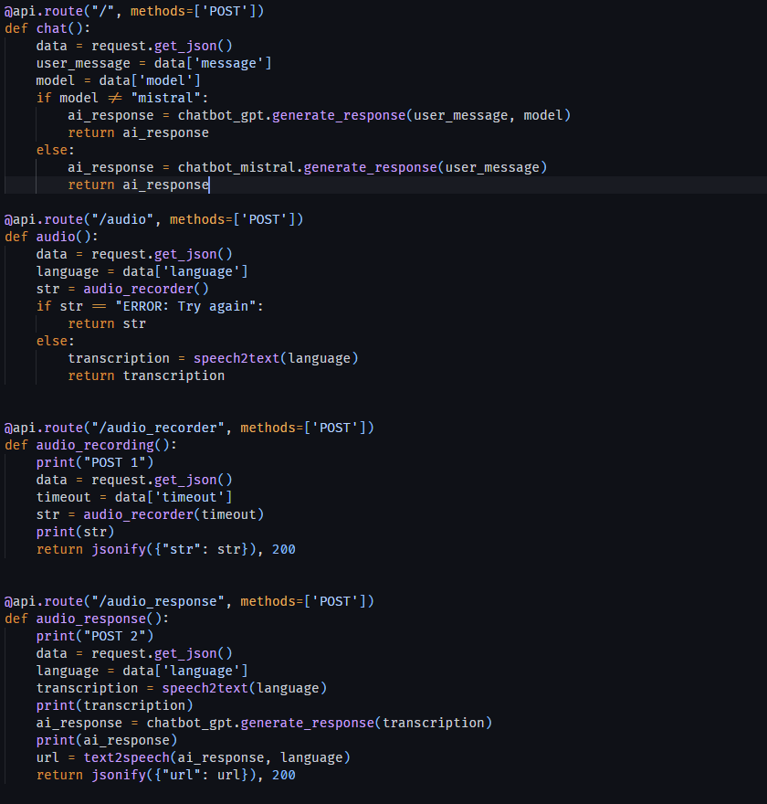

### Chat

This code defines two classes, ChatGPT and Mistral, each responsible for generating responses using different conversational AI models. Let's go through each class:
- **ChatGPT Class**
This class utilizes OpenAI's selected model for generating responses.

  - `__init__(self)`: Initializes the class by setting the OpenAI API key obtained from the environment variables.
  - `generate_response(self, user_message, model="gpt-3.5-turbo")`: 
    - Takes a `user_message` as input and an optional `model` parameter (defaulted to "gpt-3.5-turbo").
    - Generates a response by interacting with the OpenAI chat endpoint, where the user message is preceded by a system message instructing the AI to respond in the same language as the user.
    - Iterates over the responses and concatenates them to form the AI's final response, which is returned after removing the last four characters (typically, they are "none").

-  **Mistral Class**
This class utilizes the Mistral conversational AI platform for generating responses.

   - `__init__(self)`: Initializes the class by setting the Mistral API key obtained from the environment variables and specifying the model to be used.
   - `generate_response(self, user_message)`: 
     - Takes a `user_message` as input and generates a response by sending the user message to the Mistral chat endpoint.
     - The response is returned after accessing the content of the message from the Mistral response.

Overall, these classes encapsulate the functionality of interacting with different conversational AI models and provide methods for generating responses based on user input. They abstract away the complexities of API interactions and model handling, making it easier to integrate conversational AI capabilities into applications.


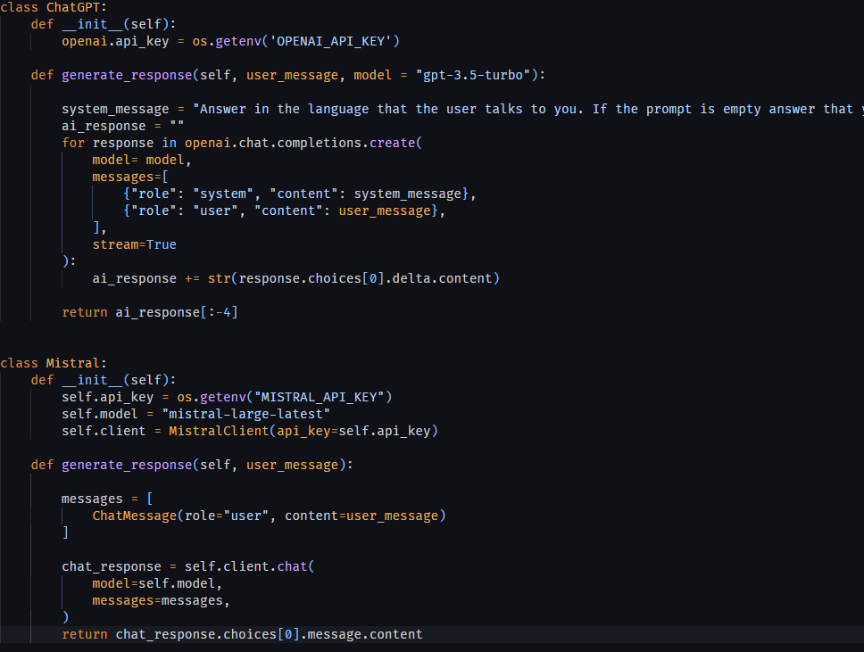

### Audio recorder
- `audio_recorder(timeout=3)`: 
  - Accepts an optional `timeout` parameter (defaulted to 3 seconds) specifying the duration to wait for user input.
  - Enters a loop to continuously attempt audio recording until successful or until a timeout occurs.
  - Within the loop:
    - Sets the filename to "audio.wav".
    - Opens the microphone as a source for recording using the `speech_recognition` library.
    - Adjusts for ambient noise and sets the pause threshold for audio recognition.
    - Attempts to record audio within the specified timeout duration.
    - If a `WaitTimeoutError` occurs (indicating a timeout), prints "Timeout" and returns an error message "ERROR: Try again".
    - Writes the recorded audio data to the WAV file named "audio.wav".
  - Returns "Completed recording!" after successful recording.

This function provides a simple way to record audio input from the user using the system's microphone and handle timeouts gracefully.
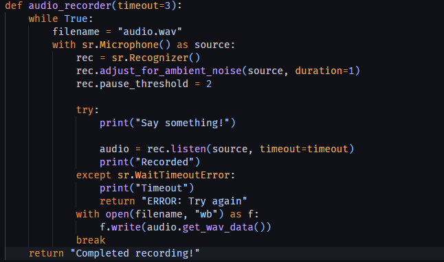

### Speech2Text
This function transcribes speech from an audio file to text using the Deepgram API.

- `speech2text(language)`: 
  - Accepts a `language` parameter specifying the language for transcription.
  - Attempts to transcribe speech from the audio file using the Deepgram API.
  - Within a try-except block:
    - Initializes a Deepgram client using the API key obtained from environment variables.
    - Reads the audio file ("audio.wav") as binary data.
    - Constructs a payload containing the audio data.
    - Specifies transcription options including the model, smart format, and language.
    - Sends the transcription request to the Deepgram API.
    - Parses the response to extract the transcription.
    - Returns the transcribed text.
  - If an exception occurs during the process, it prints the error and returns the error message.

This function provides a convenient way to transcribe speech from audio files using the Deepgram API, handling exceptions gracefully.

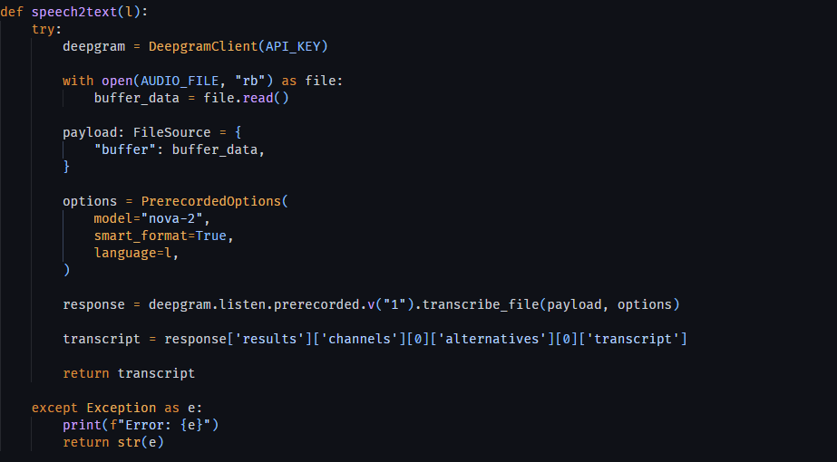

### Text2Speech
This function converts text to speech using either the Deepgram API or the Eleven Labs API, depending on the specified language.

- `text2speech(transcription, language="en")`: 
  - Accepts a `transcription` parameter containing the text to be converted to speech and an optional `language` parameter specifying the language (defaulted to "en").
  - Loads environment variables from the `.env` file.
  - Sets up the necessary configurations for Cloudinary.
  - If the language is English ("en"):
    - Constructs the URL and headers for the Deepgram API.
    - Sends a POST request to the Deepgram API with the transcription.
    - If the response status code is 200("OK"), saves the audio content to a file and prepares to upload it to Cloudinary.
    - Otherwise, prints an error message.
  - If the language is not English:
    - Constructs the URL and headers for the Eleven Labs API.
    - Sends a POST request to the Eleven Labs API with the transcription.
    - Writes the audio content to a file.
    - Prepares to upload the file to Cloudinary.
  - Returns the result of uploading the audio file to Cloudinary.

- `prepare_upload_audio(file_path='audio/out.mp3', format='mp3')`: 
  - Accepts optional parameters `file_path` and `format` specifying the file path and format of the audio file (defaulted to "audio/out.mp3" and "mp3" respectively).
  - Uploads the audio file to Cloudinary and returns the secure URL of the uploaded file.

This function provides a way to convert text to speech using either the Deepgram API or the Eleven Labs API, and then upload the resulting audio file to Cloudinary.

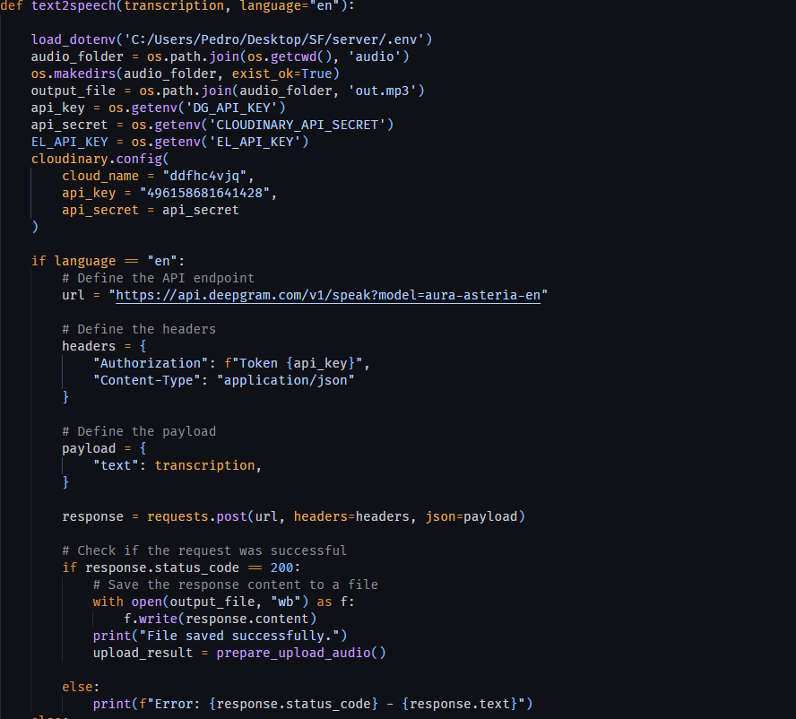

## - Frontend(ReactJS): 

### App.js
This React component sets up the routing for the application using React Router.

- `App()`: 
  - This functional component defines the structure of the application.
  - It uses the `Router` component from React Router to set up client-side routing.
  - Inside the `Router`, it defines different routes using the `Route` component.
  - The `Routes` component wraps all the `Route` components and serves as the container for route configuration.
  - Three routes are defined:
    - The root route ("/") renders the `Chat` component.
    - The "/whisper" route renders the `Whisper` component.
    - The "/conversation" route renders the `Conversation` component.

This component ensures that different components are rendered based on the URL path, enabling navigation within the application without full-page refreshes.

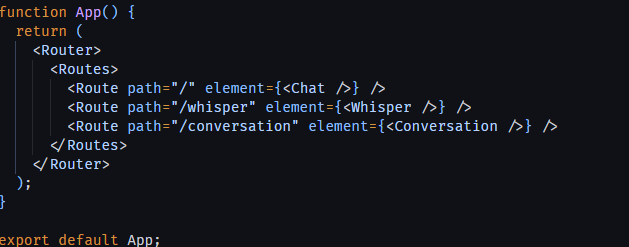

### Chat.js

This React functional component represents the chat interface of the application.

- **State Variables:**
  - `question`: Stores the user's current question or message.
  - `messages`: Stores the chat messages exchanged between the user and the chatbot.
  - `isRecording`: Indicates whether the microphone is currently recording.
  - `selectedModel`: Stores the selected conversational AI model.
  - `selectedLanguage`: Stores the selected language for conversation.

- **Functions:**
  - `toggleRecording`: Toggles the microphone recording state. If recording, sends a POST request to the '/audio' endpoint to transcribe speech to text.
  - `handleChange`: Updates the `question` state as the user types in the input field.
  - `handleSubmit`: Handles form submission by sending a POST request to the '/' endpoint with the user's message and model selected.
  - `ClearChat`: Clears the chat messages stored in the `messages` state.
  - `handleModelChange`: Updates the `selectedModel` state when the user selects a different conversational AI model.
  - `handleLanguageChange`: Updates the `selectedLanguage` state when the user selects a different language.

- **UI Elements:**
  - Dropdown menus for selecting the model and language.
  - Buttons for clearing the chat, accessing whisper mode, and toggling microphone recording.
  - Chat message display area where user messages and chatbot responses are rendered.
  - Input field for typing messages and sending them to the chatbot.

- **Routing:**
  - The component includes a link to whisper mode ("/whisper") using React Router's `Link` component.

This component serves as the main interface for interacting with the chatbot, allowing users to send messages, receive responses, and configure settings such as the AI model and language. 

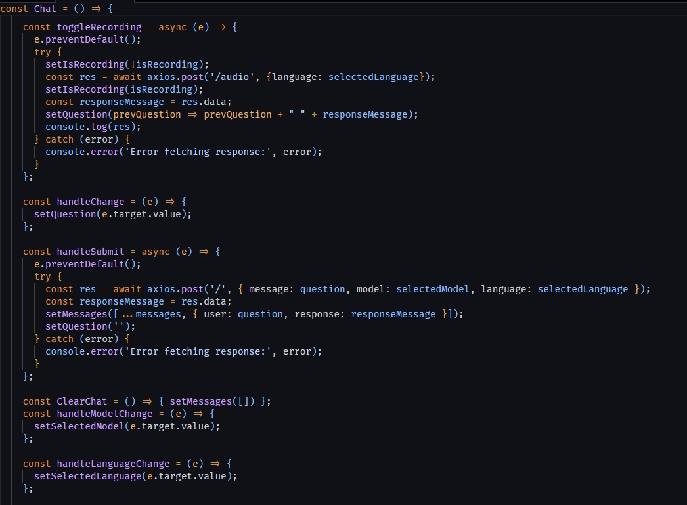

### Whisper.js

This React functional component represents the language selection interface for whisper mode.

- **State Variable:**
  - `selectedLanguage`: Stores the selected language for whisper mode.

- **Hooks:**
  - `useState`: Used to manage the state of `selectedLanguage`.
  - `useNavigate`: Hook from React Router used for navigation.

- **Functions:**
  - `handleLanguageChange`: Updates the `selectedLanguage` state when the user selects a different language.
  - `handleSubmit`: Handles form submission by navigating to the "/conversation" route with the selected language as state.

- **UI Elements:**
  - Flag images representing the language options (English and Spanish).
  - Radio buttons for selecting the language.
  - Submit button to confirm the language selection and proceed to the conversation.

- **Routing:**
  - Upon form submission, the component uses the `useNavigate` hook to navigate to the "/conversation" route with the selected language passed as state.

This component serves as the interface for selecting the language in whisper mode, allowing users to choose between English and Spanish before starting the conversation.

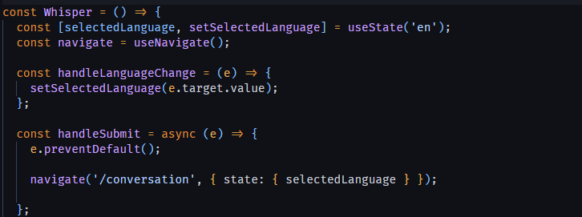

### Conversation.js

This React functional component represents the conversation interface where users can interact with the chatbot.

- **State Variables:**
  - `selectedLanguage`: Stores the selected language passed from the previous route.
  - `isRecording`: Indicates whether the microphone is currently recording.
  - `isLoading`: Indicates whether the response is being generated.
  - `isPlaying`: Indicates whether the response audio is currently playing.

- **Hooks:**
  - `useLocation`: Hook from React Router used to access the location object.
  - `useNavigate`: Hook from React Router used for navigation.
  - `useState`: Used to manage the state variables.

- **Functions:**
  - `goBackToChat`: Navigates back to the chat interface.
  - `toggleRecording`: Toggles the microphone recording state. Sends a POST request to record audio and receive a response.
  - `handleSwitchChange`: Handles the change in the half-duplex mode switch. When enabled, initiates recording and response playback.

- **UI Elements:**
  - Loader components (`Comment` and `Bars`) displayed when loading or playing responses.
  - Microphone button (`🎙️`) for starting recording.
  - Back button to navigate back to the chat interface.
  - Switch component for enabling/disabling half-duplex mode.

- **Functionality:**
  - The component handles the recording, response generation, and playback functionalities based on user interactions.
  - It provides feedback to the user through loading spinners and status messages.

This component serves as the interface for engaging in conversation with the chatbot, providing options for recording audio input and toggling half-duplex mode.

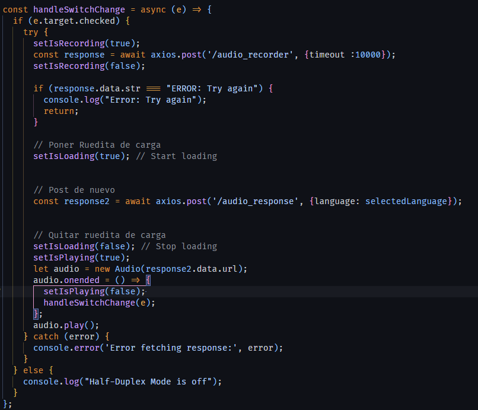

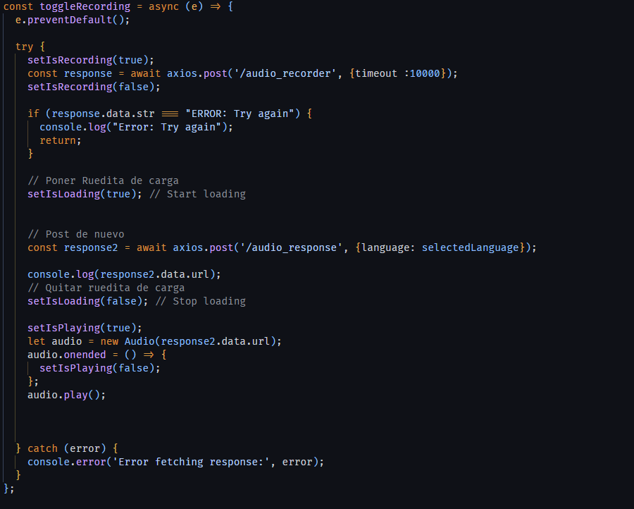


## Contact Us

For support or inquiries, reach out to our team at [pedrosarmientoyanez@gmail.com](mailto:pedrosarmientoyanez@gmail.com).

